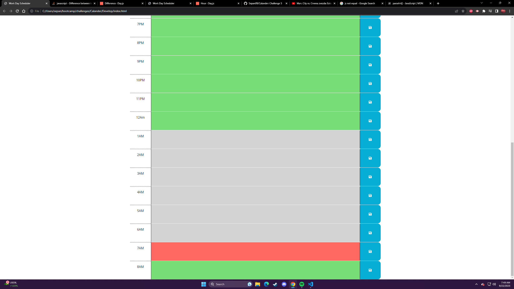

# Calander

# Description: Edited this code as challenge 5. Had to use day.js() to get the time and compare it in java script. Had to use Jquery in Java script to code the program.

# Website:

# Webpage:
https://sepan09.github.io/Calander/
